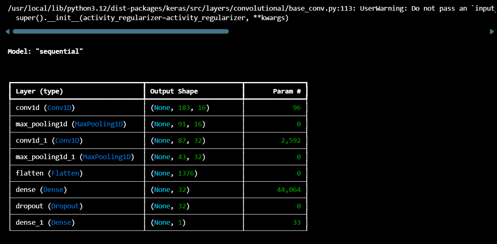
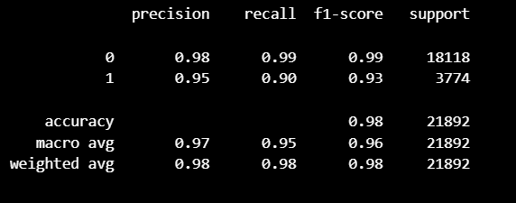
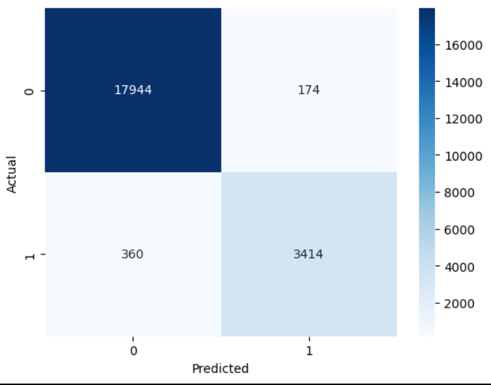
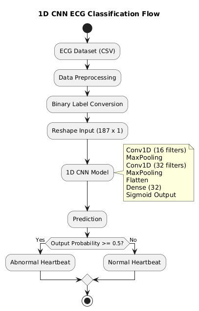
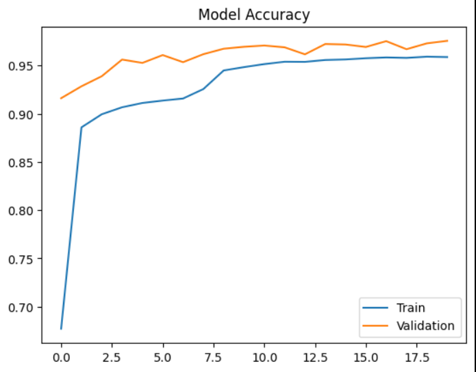

## 1D CNN-Based ECG Classification for Edge Deployment

---

1. OBJECTIVE

The objective of this assignment is to evaluate understanding of
Machine Learning (ML) and TinyML concepts by designing,
implementing, and analyzing a lightweight classification model
for ECG signal classification.

The focus includes:

- Model selection and justification
- Feature explanation
- Training and evaluation results
- Suitability for TinyML / edge deployment

---

2. DATASET DESCRIPTION

The dataset used in this project is derived from the
MIT-BIH Arrhythmia Database (PhysioNet).

Source:
MIT-BIH Arrhythmia Database
PhysioNet Research Data Repository

For implementation, a preprocessed CSV version from Kaggle was used.

Each row in the dataset contains:

- 187 ECG time-series sample values
- 1 label column

Original labels:
0 → Normal
1–4 → Different arrhythmia types

For this assignment, the problem was converted to binary classification:

0 → Normal
1–4 → Abnormal

---

3. MODEL SELECTION AND JUSTIFICATION

Selected Model: 1D Convolutional Neural Network (1D CNN)

Reason for Selection:

1. ECG signals are time-series data.
2. 1D CNNs are suitable for extracting temporal patterns.
3. Convolution layers automatically learn waveform features.
4. Better performance compared to linear models.
5. Can be designed as a lightweight architecture for TinyML.

Unlike classical ML models that require manual feature engineering,
the CNN automatically extracts relevant features from raw ECG signals.

---

4. FEATURE SELECTION

Manual feature extraction was not performed.

Instead:

- All 187 ECG signal values were directly used as input.
- Feature extraction was handled automatically by convolution layers.

Advantages:

- Reduces preprocessing complexity.
- Captures local waveform patterns.
- Minimizes human bias in feature design.
- Improves generalization.

Input shape used for model:
(samples, 187, 1)

---

5. MODEL SUMMARY

The following screenshot provides the model summary

## 

6. PERFORMANCE EVALUATION

The model was evaluated using the following metrics:

6.1. Accuracy

Accuracy = (TP + TN) / (TP + TN + FP + FN)

Test Accuracy: 99.92%

---

6.2. Precision, Recall, F1-score

Precision = TP / (TP + FP)

Recall = TP / (TP + FN)

F1 = 2 _ (Precision _ Recall) / (Precision + Recall)

## 

A confusion matrix was generated to visualize:

- True Positives
- True Negatives
- False Positives
- False Negatives

## 

---

7. TINYML SUITABILITY ANALYSIS

Although no hardware deployment was performed,
the model’s suitability for edge deployment was analyzed.

7.1 Model Size

Total Parameters: 46,785

Estimated memory usage:
Float32 representation: ~187 KB
After int8 quantization: ~46 KB

This size is suitable for microcontrollers with limited memory.

7.2 Inference Latency

The model has:

- Only two convolution layers
- A small dense layer
- A shallow architecture

This ensures reduced computational overhead
and low inference time.

7.3 Computational Efficiency

The model avoids:

- Deep stacked networks
- Large fully connected layers
- Complex recurrent layers

Therefore, it is appropriate for TinyML simulation
and edge deployment scenarios.

---

8. FLOW DIAGRAM OF IMPLEMENTATION

## 

---

9. MODEL ACCURACY GRAPH

## 

---

10. CONCLUSION

A lightweight 1D CNN model was successfully implemented
for ECG classification.

The model achieved strong classification performance
while maintaining a relatively small parameter count
(~46,785 parameters).

After quantization, the model size reduces significantly,
making it suitable for TinyML-based edge deployment.

This assignment demonstrates understanding of:

- Model selection and justification
- Automatic feature extraction
- Performance evaluation
- Edge/TinyML suitability analysis

---
