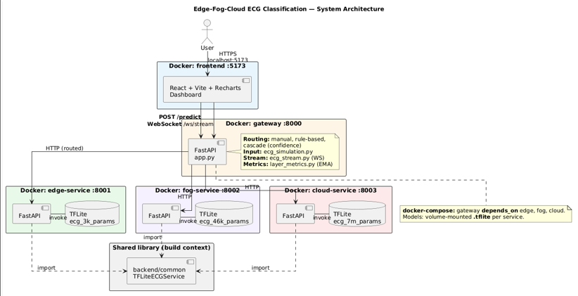
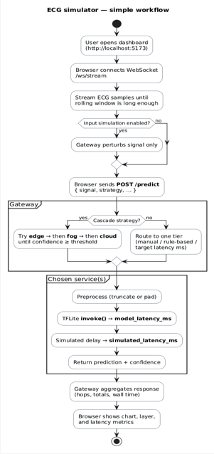

# Edge-Fog-Cloud ECG Classification Simulator

This project simulates ECG classification across edge, fog, and cloud layers.

The app has:
- A frontend dashboard with live chart, routing controls, and metrics
- A gateway service that routes requests
- Three model services that run TensorFlow Lite models

## Architecture Diagram



## Workflow Diagram



## Model Results

The table below uses the final printed results from:
- `ecg-3k-params.ipynb`
- `ecg-46k-params.ipynb`
- `ecg-7m-params.ipynb`

| Layer | Model File | Parameters | Model Size | Accuracy | Precision | Recall | F1-score | Test Loss | Source Notebook |
|---|---|---:|---:|---:|---:|---:|---:|---:|---|
| Edge | `ecg_3k_params.tflite` | 3,969 | 15.5 KB | 0.9714 | 0.97 | 0.97 | 0.97 | 0.0910 | `ecg-3k-params.ipynb` |
| Fog | `ecg_46k_params.tflite` | 46,785 | 182.75 KB | 0.9820 | 0.98 | 0.98 | 0.98 | 0.0638 | `ecg-46k-params.ipynb` |
| Cloud | `ecg_7m_params.tflite` | 7,157,633 | 27.30 MB | 0.9885 | 0.98 | 0.99 | 0.98 | 0.1131 | `ecg-7m-params.ipynb` |

Precision, recall, and F1-score values are from the weighted average row in each notebook classification report.

## Routing Strategies

Gateway endpoint: `POST /predict`

Manual strategy:
- You choose the target layer directly from the UI.
- The gateway sends the request only to that layer.
- This is useful when you want to compare one layer at a time.
- It is the clearest mode for baseline testing.

Rule-based strategy:
- The gateway selects the layer based on your preference settings.
- `low_latency` favors edge, `high_accuracy` favors cloud.
- `balanced` uses rule logic and signal complexity for routing.
- This mode is useful for normal operation without fixed manual control.

Cascade strategy:
- The gateway starts at edge and checks model confidence.
- If confidence is below threshold, it escalates to fog, then cloud.
- It stops as soon as confidence reaches the threshold.
- This mode is useful when you want adaptive accuracy with controlled latency.

## Services

- Frontend: React, Vite, Recharts
- Gateway: FastAPI, routing logic, WebSocket stream
- Model services: FastAPI + `tensorflow.lite.Interpreter`

## Latency Ranges

- Edge: 5-10 ms
- Fog: 20-50 ms
- Cloud: 100-300 ms

## Run

```bash
docker compose up --build
```

## URLs

- Frontend: `http://localhost:5173`
- Gateway docs: `http://localhost:8000/docs`
- Edge docs: `http://localhost:8001/docs`
- Fog docs: `http://localhost:8002/docs`
- Cloud docs: `http://localhost:8003/docs`
